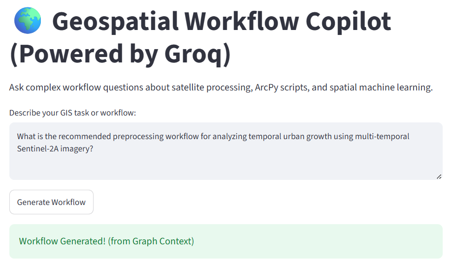
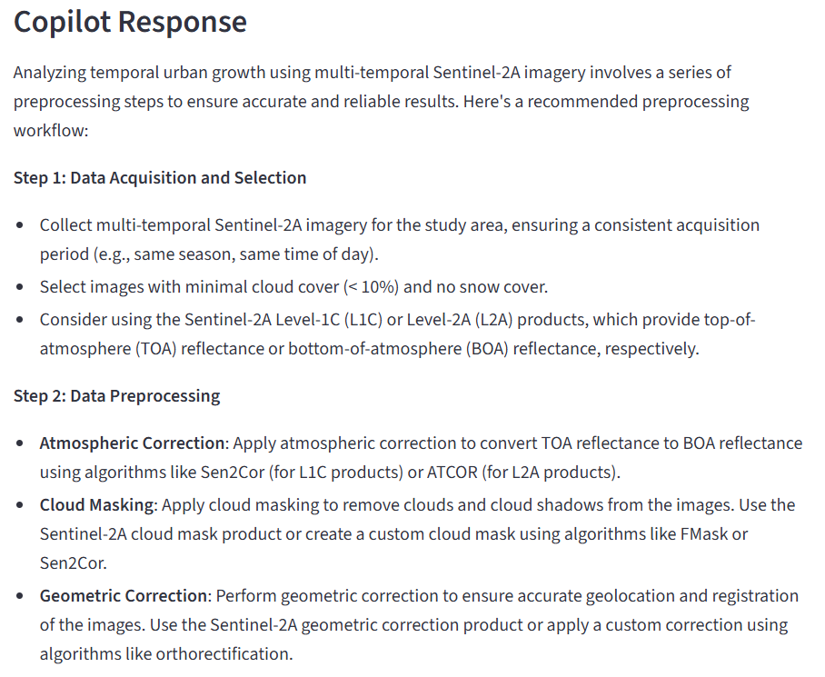
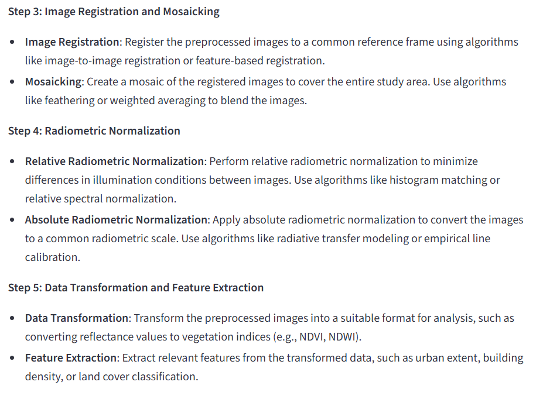
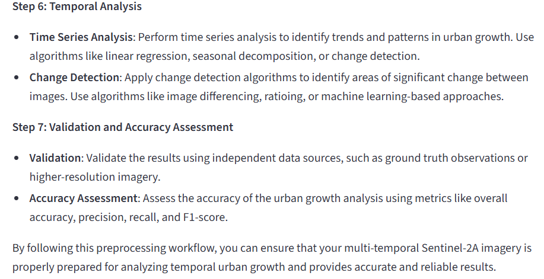
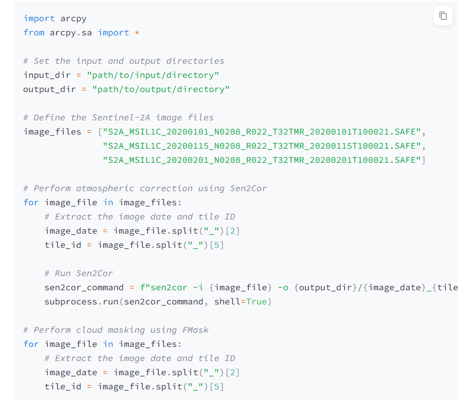
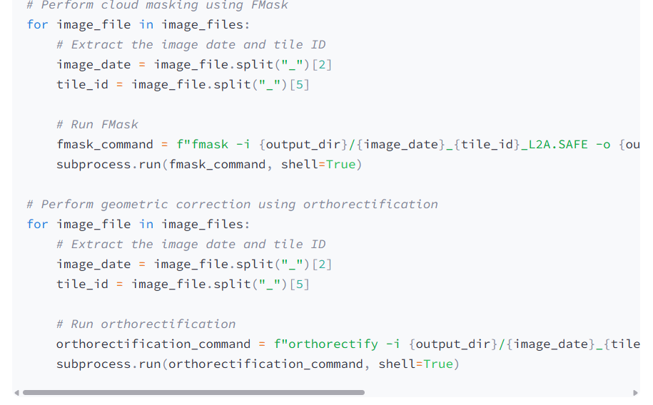

<div align="center">

# 🌍 Geospatial Workflow Copilot
### Knowledge Graph Retrieval-Augmented Generation (GraphRAG)

[]()
[]()
[]()
[]()
[]()

*A domain-specific AI assistant for Geographic Information Systems (GIS), Remote Sensing workflows, and Spatial Machine Learning.*

</div>

---

## 📸 Platform Overview

Standard vector-search RAG pipelines struggle with complex, multi-step geospatial workflows because they rely purely on text proximity. This application builds a structured **Knowledge Graph** to explicitly connect software functions, algorithms, satellite platforms, and geostatistical parameters—ensuring precise code syntax and workflow recommendations without hallucinating dependencies.

<div align="center">
  <table>
    <tr>
      <td align="center"><b>💻 Streamlit Interface</b><br></td>
      <td align="center"><b>🕸️ Graph Traversal</b><br></td>
      <td align="center"><b>⚙️ ArcPy Code Generation</b><br></td>
    </tr>
    <tr>
      <td align="center"><b>🛰️ Satellite Data Logic</b><br></td>
      <td align="center"><b>🧠 LLM Entity Extraction</b><br></td>
      <td align="center"><b>📊 Spatial ML Workflows</b><br></td>
    </tr>
  </table>
</div>

---
 flowchart TB
    %% Styling configurations
    classDef llm fill:#f3e5f5,stroke:#4a148c,stroke-width:2px,color:#000
    classDef db fill:#fff3e0,stroke:#e65100,stroke-width:2px,color:#000
    classDef pipeline fill:#e1f5fe,stroke:#01579b,stroke-width:2px,color:#000
    classDef ui fill:#e8f5e9,stroke:#1b5e20,stroke-width:2px,color:#000
    classDef input fill:#fafafa,stroke:#424242,stroke-width:1px,color:#000

%% Top Level External Services
    subgraph External Compute & Services
        direction LR
        GROQ((🚀 Groq LPU\nllama-3.3-70b)):::llm
        LANGCHAIN((🦜 LangChain\nOrchestration)):::pipeline
    end

  %% Left Side: Data Ingestion
    subgraph Data Layer
        direction TB
        DOCS[/📄 Geospatial PDFs\nArcPy, Sentinel, ML/]-.-> LOADER
        LOADER[PyPDF Loader]:::input -.-> SPLITTER
        SPLITTER[Recursive Text Splitter]:::input
    end

  %% Center-Left: Ingestion Pipeline (Graph Builder)
    subgraph Knowledge Graph Ingestion
        direction TB
        EXTRACTOR{LLM Graph Transformer\nExtracts Nodes & Edges}:::llm
        SPLITTER --> EXTRACTOR
    end

  %% Bottom Center: Memory Layer (Database)
    subgraph Memory Layer
        direction TB
        GRAPH_DB[(🕸️ Neo4j AuraDB\nGeospatial Graph)]:::db
        EXTRACTOR == Populates ==> GRAPH_DB
    end

  %% Center-Right: GraphRAG Decision Pipeline
    subgraph GraphRAG Decision Pipeline
        direction TB
        CYPHER_AGENT{Cypher Generation Agent}:::llm
        VALIDATOR[Syntax Validator]:::pipeline
        SYNTHESIS{Context Synthesis Agent}:::llm
        FALLBACK{Domain Fallback Agent}:::llm
        
 CYPHER_AGENT --> VALIDATOR
        VALIDATOR == Executes Query ==> GRAPH_DB
        GRAPH_DB == Returns Graph Context ==> SYNTHESIS
        GRAPH_DB -. Empty Context .-> FALLBACK
    end

   %% Right Side: Execution & UI
    subgraph Execution & UI Layer
        direction TB
        STREAMLIT[🌐 Streamlit Web App]:::ui
        OUTPUT[/💻 ArcPy Code & Workflow/]:::ui
        
  STREAMLIT == User Query ==> CYPHER_AGENT
        SYNTHESIS --> OUTPUT
        FALLBACK --> OUTPUT
        OUTPUT -. Renders in .-> STREAMLIT
    end

   %% Cross-layer LLM Connections
    GROQ -. Powers .-> EXTRACTOR
    GROQ -. Powers .-> CYPHER_AGENT
    GROQ -. Powers .-> SYNTHESIS
    GROQ -. Powers .-> FALLBACK
## ✨ Key Features

* **Knowledge Graph Ingestion:** Autonomously extracts domain entities (*Software, Satellite, Algorithm, Parameter, Dataset, Workflow*) and maps their relationships (*USES, PROCESSES, REQUIRES, CLIPS, MOSAICS*) using `LLMGraphTransformer`.
* **Ultra-Fast Inference:** Leverages Groq's `llama-3.3-70b-versatile` LPU model for lightning-fast Cypher query generation and workflow synthesis.
* **Hybrid Retrieval Engine:** Combines structured graph context traversing Neo4j Aura with a domain-aware LLM fallback mechanism for complete, end-to-end code generation.
* **Remote Sensing & ML Focus:** Highly specialized in generating scripts for satellite band indexing (NDBI, MNDWI), temporal urban growth analysis, precision geostatistics (like Kriging ranges), and geospatial machine learning algorithms (FCM, MLP, SVM).

---

## 🛠️ Architecture Stack

| Component | Technology | Description |
| :--- | :--- | :--- |
| **Frontend** | Streamlit | Responsive, interactive web application UI. |
| **Orchestration** | LangChain | Integrates `langchain-groq` and `langchain-neo4j`. |
| **LLM Engine** | Groq API | High-speed processing via Llama 3.3 70B. |
| **Graph Database**| Neo4j AuraDB | Cloud-native graph storage and Cypher execution. |
| **Data Parser** | PyPDF | Automated chunking and parsing of dense GIS literature. |

---

## 📂 Project Structure

```text
geospatial-graphrag/
│
├── data/                  # Local directory for geospatial PDFs (literature, manuals)
├── app.py                 # Streamlit frontend & GraphRAG QA chain pipeline
├── ingest_graph.py        # Knowledge Graph initialization & entity extraction script
├── requirements.txt       # Python package dependencies
├── .env.example           # Template for API keys (rename to .env locally)
├── .gitignore             # Secures credentials from being pushed to GitHub
└── README.md              # Project documentation
